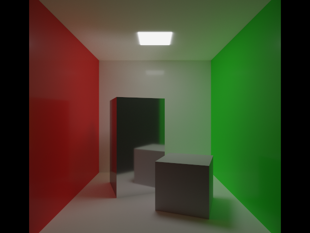

# raytracer

This is a simple raytracer written in Rust.

## implemented BRDFs

- Lambertian
- [Disney](https://media.disneyanimation.com/uploads/production/publication_asset/48/asset/s2012_pbs_disney_brdf_notes_v3.pdf)

## to-dos

- [ ] fix clearcoat
- [ ] apply specular tint
- [x] implement NEE and MIT
- [ ] implement subsurface
- [ ] implement sheer
- [ ] implement anisotropic
